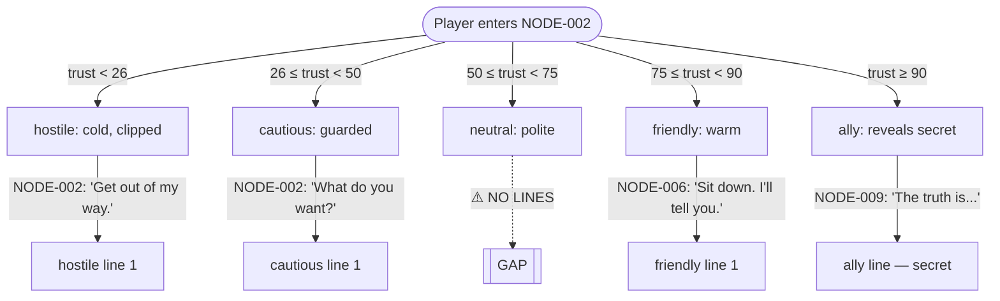

# speckit.dialogue

Dialogue tree builder — **extract, map, and validate** all NPC conversation content across the game. Produces a structured dialogue tree per character showing trust-gated branches, reachability, and coverage gaps. Optionally audits dialogue craft.

## Dialogue Model

The speckit dialogue system is **trust-register gated**, not a classic branching tree:

- Each NPC has a **voice spec** (`characters.md §II`) defining how they sound
- Each **trust level** (hostile / cautious / neutral / friendly / ally) maps to a distinct speech register (`characters.md §VIII`)
- Each **NPC state** (alive / dead / hostile / absent) gates which dialogue is reachable (`characters.md §IX`)
- Dialogue is distributed across **node files** — each node contains the lines appropriate to its trust/state preconditions

A dialogue tree for a character is therefore: all their lines across all nodes, ordered by trust level and state, with branch conditions shown.

## User Input

```text
$ARGUMENTS
```

Accepted input:
- Nothing — build dialogue trees for all named NPCs
- Character name (e.g. `Mira`) — build tree for one character only
- `--node [NODE-ID]` — extract dialogue structure from one node only

Optional flags:
- `--unreachable` — focus report on lines no trust/state path can reach
- `--gaps` — focus report on trust levels or states with no written lines
- `--craft` — add secondary craft audit (on-the-nose dialogue, said-bookisms, dead exchanges, exposition dumps)
- `--output [filename]` — write tree to a named file instead of printing
- `--mermaid` — output conversation flowchart as a Mermaid diagram

## Pre-Execution Checks

1. Load `specs/characters.md` (or `specs/[FEATURE_DIR]/characters.md`):
   - Extract all named NPCs
   - For each NPC: record voice spec (§II), trust table (§VII), register definitions (§VIII), state machine (§IX)
2. Load `specs/plan.md`: node sequence, act boundaries, which NPCs appear in which nodes
3. Load all `draft/[ENGINE]/NODE-*.md` (or `nodes/NODE-*.md`) files:
   - Extract all dialogue lines, speaker tags, and their trust/state preconditions
4. Load `specs/constitution.md`: prose profile (dialogue-heavy / atmospheric / etc.), POV, tense

## Execution Steps

### 1. **Extract Dialogue Inventory**

Scan every node file. For each line of dialogue (spoken content in quotes, or tagged with a speaker name):

```
Node:        [NODE-ID]
Speaker:     [NPC name]
Line:        "[exact text]"
Condition:   trust >= N | npc_state = X | flag = Y | unconditional
Trust level: hostile / cautious / neutral / friendly / ally / unknown
```

Group by character. Sort by node order within each trust level.

### 2. **Map Trust Coverage**

For each NPC, produce a coverage table:

```
CHARACTER: [Name]
Trust levels defined in characters.md: hostile | cautious | neutral | friendly | ally

| Trust Level | Lines Found | Nodes | Condition Correct | Gap |
|-------------|-------------|-------|-------------------|-----|
| hostile     | 3           | NODE-002, NODE-004 | ✅ | — |
| cautious    | 5           | NODE-002, NODE-005 | ✅ | — |
| neutral     | 0           | —     | —                 | ⚠️ NO LINES |
| friendly    | 4           | NODE-006, NODE-008 | ✅ | — |
| ally        | 2           | NODE-009 | ✅             | — |
```

**Gap** = a trust level that has a register defined in `characters.md §VIII` but zero dialogue lines in any node.

### 3. **Map State Coverage**

For each NPC state defined in `characters.md §IX`:

```
| State   | Lines Found | Nodes | Reachable? |
|---------|-------------|-------|------------|
| alive   | 14          | multiple | ✅       |
| dead    | 0           | —     | ⚠️ NO LINES — state defined but unwritten |
| hostile | 3           | NODE-007 | ✅      |
```

### 4. **Build Dialogue Tree**

For each character, construct the full conversation tree:

```
[CHARACTER NAME] — Dialogue Tree

TRUST: hostile (0–25)
  └─ NODE-002: "[hostile line 1]"
  └─ NODE-004: "[hostile line 2]"
       └─ [if flag_confronted]: "[conditional line]"

TRUST: cautious (26–49)
  └─ NODE-002: "[cautious line 1]"
  └─ NODE-005: "[cautious line 2]"

TRUST: neutral (50–74)
  └─ [NO LINES — GAP ⚠️]

TRUST: friendly (75–89)
  └─ NODE-006: "[friendly line 1]"
       └─ [choice: "Ask about the past"] → "[friendly line 2]"
  └─ NODE-008: "[friendly line 3]"

TRUST: ally (90–100)
  └─ NODE-009: "[ally line 1 — reveals secret]"

STATE: dead
  └─ [NO LINES — GAP ⚠️]
```

### 5. **Reachability Analysis**

For each conditional line, verify the condition is satisfiable:
- Does any path through the node graph allow `trust >= N` at the node where the line appears?
- Does any path set the required flag before the node?
- Does any choice sequence produce the required NPC state?

Flag unreachable lines:

```
⚠️  UNREACHABLE — [CHARACTER] in [NODE-ID]
Line: "[text]"
Condition: trust >= 90
Reason: No path raises trust above 75 before this node — ally lines are never reachable
```

### 6. **Mermaid Diagram** (if `--mermaid` or default for single character)

Output a Mermaid flowchart of the character's conversation graph:



Write to `dialogue-[character-name].md` or `--output` filename.

### 7. **Craft Audit** (only if `--craft` flag set)

For each extracted line, additionally flag:

| Issue | Description | Example |
|---|---|---|
| `ON-THE-NOSE` | Character states feeling/intention directly | "I'm afraid of losing you." |
| `EXPOSITION-DUMP` | NPC explains what both parties already know | "As you know, the king has been ill since..." |
| `SAID-BOOKISM` | Non-said dialogue tag (`hissed`, `retorted`, `exclaimed`) | `she hissed angrily` |
| `DEAD-EXCHANGE` | Both characters agree, nothing at stake, no subtext | Mutual affirmation with no tension |
| `FUNCTIONAL-ONLY` | Line exists only to deliver plot info, no character voice | Pure quest marker delivery |
| `REGISTER-MISMATCH` | Line doesn't match the trust level's defined register | Warm/ally-style line appearing at hostile trust |

For each craft flag:
```
⚠️  [ISSUE TYPE] — [CHARACTER] in [NODE-ID]
Line: "[offending text]"
Issue: [explanation]
Suggestion: [concrete revision direction]
```

## Output Format

```
# Dialogue Tree Report — [Game Title / Feature]
Generated: [date]

## Summary
- NPCs analysed: [N]
- Total dialogue lines: [N]
- Trust gaps: [N]
- State gaps: [N]
- Unreachable lines: [N]
- Craft issues: [N] (if --craft)

## [Character Name]
[Coverage table]
[Dialogue tree]
[Unreachable lines]
[Mermaid diagram if --mermaid]

## [Next Character]
...

## Action Items
[Prioritised list: fill gaps first, then unreachable, then craft]
```

If no issues are found: confirm full coverage and note any dialogue standouts.
